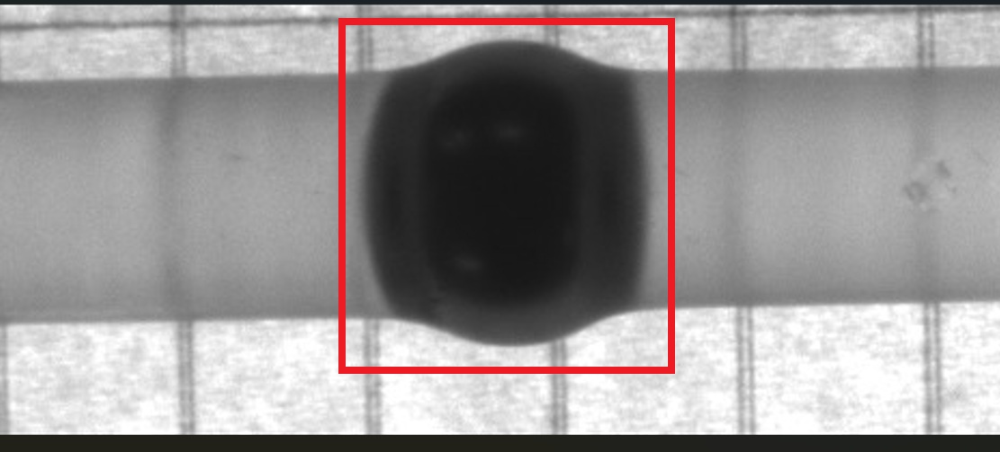
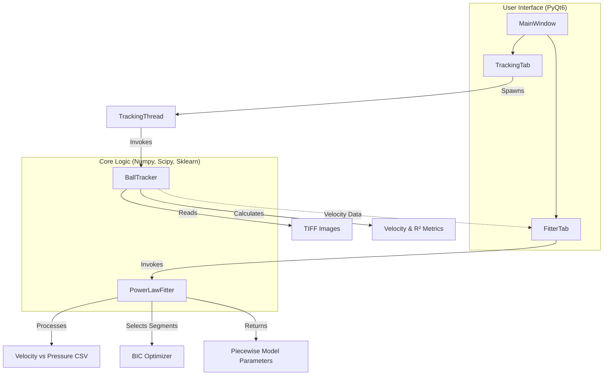

# Elastic Flow Analysis

**A computer vision software for analysing coupled elastohydrodynamics and force-velocity relationships in lubricated flexible systems.**

## 1. Core Functionality & USPs

The application is a specialised tool for **Elastohydrodynamics Motion Analysis**, designed to bridge the gap between raw experimental image data and physical power-law modeling.

### Key Features

- **Automated Ball Tracking**: Extracts spatial centroids from high-frequency TIFF image sequences.
- **Robust Velocity Estimation**: Utilises RANSAC-based linear regression to calculate velocity while ignoring tracking artifacts or noise.
- **Piecewise Power-Law Fitting**: Automatically identifies transitions in flow regimes (e.g., Newtonian to non-Newtonian) using Bayesian Information Criterion (BIC).
- **Outlier Rejection**: Employs Huber regression and Median Absolute Deviation (MAD) for reliable fitting in the presence of experimental outliers.
- **Integrated Visualization**: Real-time plotting of trajectory fits and power-law segments using Matplotlib embedded in a PyQt6 interface.

<p align="center">
  
</p>

## 2. Directory Structure

```text
elastic-flow-analysis/
├── main.py                 # Application entry point
├── requirements.txt        # Python dependencies
├── pixi.toml               # Environment configuration (Pixi)
├── src/
│   ├── core/               # Mathematical models and processing logic
│   │   ├── fitter.py       # Piecewise power-law regression engine
│   │   └── tracker.py      # Image processing and velocity tracker
│   └── gui/                # Desktop interface components (PyQt6)
│       ├── main_window.py  # Root application window
│       ├── tracking_tab.py # UI for motion analysis
│       ├── fitter_tab.py   # UI for power-law analysis
│       └── mpl_widget.py   # Matplotlib integration widget
```

## 3. System Architecture & Data Flow

The system follows a classic **Model-View-Controller (MVC)** pattern, where the `gui` layer manages user interaction and visualization, while the `core` layer handles computationally intensive mathematical tasks.

### Flow Diagram



## 4. Technical Stack

- **Language**: Python 3.x
- **GUI Framework**: PyQt6
- **Data Science**: NumPy, SciPy, Pandas, Scikit-learn
- **Image Processing**: Pillow (PIL)
- **Modelling**: `pwlf` (Piecewise Linear Fit)
- **Visualisation**: Matplotlib
